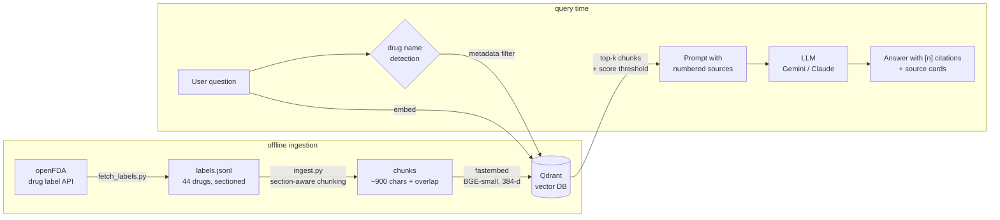

# PharmaRAG: drug-label Q&A with traceable sources

Ask a question about a common drug and get a short answer written **only** from official FDA drug labels. Every sentence cites the label section it came from, with a link to the original on DailyMed. If the labels don't contain the answer, the system refuses instead of guessing.

> Educational demo, not medical advice.

**Live demo:** _add Vercel URL_ · **API docs:** _add HF Space URL_/docs

---

## Why this project

Clinicians and pharmacists can't use an LLM answer they can't verify. PharmaRAG applies **Retrieval-Augmented Generation (RAG)** to a small, trustworthy corpus and makes every claim traceable:

- **Grounded:** the model sees only retrieved label excerpts and must cite them as `[n]`.
- **Traceable:** each source card shows the drug, label section, similarity score, label version date and a DailyMed link.
- **Honest:** low-similarity retrieval or an unsupported question leads to an explicit "not found".
- **Measured:** a hand-written evaluation set checks retrieval quality, refusals and citations. Answers are also reviewed manually for hallucinations.

## Architecture



| Layer | Choice | Why |
|---|---|---|
| Data | openFDA Structured Product Labels | Official, public domain, already split into sections |
| Chunking | Section-aware, sentence-packed, 900 chars / 150 overlap | A chunk never mixes e.g. *Dosage* with *Contraindications* |
| Embeddings | `BAAI/bge-small-en-v1.5` via fastembed (ONNX, CPU) | Free, no API key, small enough for free hosting |
| Vector DB | Qdrant (embedded locally, Qdrant Cloud in prod) | Payload filtering by drug, same client API locally and in the cloud |
| Retrieval | Cosine top-k + drug-name metadata filter + min-score threshold | Brand names like "Eliquis" map to the generic, which cuts cross-drug noise |
| Generation | Gemini (free tier) or Claude, `temperature=0`, strict citation prompt | Provider set in `.env` |
| API | FastAPI (`/api/ask`, `/api/drugs`, `/api/health`, Swagger at `/docs`) | |
| Frontend | Static HTML/CSS/JS | No build step, deploys to Vercel as-is |
| Deploy | Docker on Hugging Face Spaces (API), Vercel (frontend) | Both free |

## Evaluation

`eval/questions.jsonl` has 16 questions covering indications, dosing, interactions, boxed warnings, special populations, brand-name lookups, lay wording, and questions the system **must refuse**: a drug outside the library and an off-topic question. There is also one edge case, a drug comparison that the labels don't make.

```bash
python scripts/evaluate.py --retrieval-only   # free, no LLM calls
python scripts/evaluate.py                    # full pipeline -> eval/report.md
```

Metrics: retrieval hit@k (expected drug **and** section among the top-k), refusal accuracy, citation rate, plus a manual verdict column (correct / partial / hallucination).

| Metric | Result |
|---|---|
| Retrieval hit@6 | _fill in_ |
| Refusal accuracy | _fill in_ |
| Answers with citations | _fill in_ |

**Findings:** _fill in after reviewing `eval/report.md`, e.g. which question types fail and why._

## Run locally

```bash
python -m venv .venv
.venv\Scripts\activate            # Windows  (macOS/Linux: source .venv/bin/activate)
pip install -r requirements.txt
copy .env.example .env            # then add your GEMINI_API_KEY
python scripts/fetch_labels.py    # download labels from openFDA
python scripts/ingest.py          # build the vector index
uvicorn app.main:app --reload     # open http://127.0.0.1:8000
```

## Project structure

```
app/            FastAPI app: config, embeddings + Qdrant store, LLM wrapper, RAG pipeline
scripts/        fetch_labels.py -> ingest.py -> evaluate.py
data/           drugs.txt (editable list), labels.jsonl (fetched labels)
eval/           questions.jsonl, generated reports
frontend/       static UI (served by FastAPI locally, deployed to Vercel)
Dockerfile      image for Hugging Face Spaces
```

## Limitations and next steps

- US FDA labels only. EU SmPCs from EMA would be the natural extension for European users.
- One label per drug (the most complete single-ingredient label), so manufacturer differences are ignored.
- Lexical drug detection. Misspellings like "metfromin" won't trigger the filter.
- Next steps: hybrid search (BM25 + dense), a reranker, and an LLM-as-judge faithfulness check alongside the manual review.

## Data and license

Drug labels come from [openFDA](https://open.fda.gov/), which is public domain. This is not an FDA product and is not endorsed by the FDA. Code is MIT-licensed.
