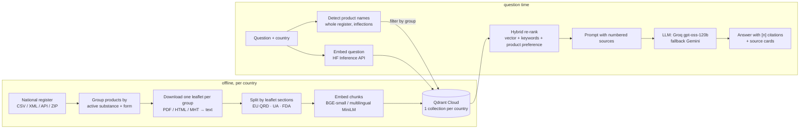

# PharmaRAG: medicine questions answered from official leaflets

Ask about a specific medicine in your language and get an answer taken **only** from the official patient
leaflet / drug label of the country you choose. Every sentence links to the exact leaflet passage it came from.
If the leaflets don't cover the question, PharmaRAG says so, and any general answer is clearly marked as such.

> Educational project, not medical advice.

**Live:** https://pharma-rag-nine.vercel.app · **API:** https://pharma-rag-smgm.onrender.com (Swagger at `/docs`)

## Coverage

| Country | Source (official open data) | Products recognised | Leaflets indexed | Chunks |
|---|---|---|---|---|
| Poland | Rejestr Produktów Leczniczych (URPL) + EMA | 20,265 | 2,426 | 64,742 |
| Ukraine | Державний реєстр лікарських засобів (MOZ, CC BY 4.0) | 12,549 | 2,998 | 93,470 |
| Czechia | SÚKL open data (DLP + PIL) | 7,595 | 1,508 | 37,179 |
| Spain | CIMA REST API (AEMPS) | 12,634 | 2,903 | 81,452 |
| France | Base de Données Publique des Médicaments (ANSM, Licence Ouverte) | 8,067 | 2,362 | 65,576 |
| United States | openFDA drug labels (public domain) | 39,968 | 3,277 (~25%, most common first) | 57,440 |
| **Total** | | **~100,000** | **~15,500** | **~400,000** |

Coming next (open data confirmed): Austria, Italy, Ireland, Sweden, Latvia, Estonia.

## How it works


```mermaid
flowchart LR
    subgraph Ingestion [offline, per country]
        R[National register<br/>CSV / XML / API / ZIP] --> G[Group products by<br/>active substance + form]
        G --> L[Download one leaflet per group<br/>PDF / HTML / MHT → text]
        L --> S[Split by leaflet sections<br/>EU QRD · UA · FDA]
        S --> E[Embed chunks<br/>BGE-small / multilingual MiniLM]
        E --> Q[(Qdrant Cloud<br/>1 collection per country)]
    end
    subgraph Query [question time]
        U[Question + country] --> D[Detect product names<br/>whole register, inflections]
        U --> V[Embed question<br/>HF Inference API]
        D -->|filter by group| Q
        V --> Q
        Q --> K[Hybrid re-rank<br/>vector + keywords + product preference]
        K --> P[Prompt with numbered sources]
        P --> M[LLM: Groq gpt-oss-120b<br/>fallback Gemini]
        M --> A["Answer with [n] citations<br/>+ source cards"]
    end
```

- **One leaflet per substance + form.** Generics copy the original's leaflet almost word for word, so the
  ~100k products are grouped and one representative leaflet per group is indexed (original brand preferred).
  Every product name still maps to its group. When the user asks about a product whose own leaflet isn't
  indexed (e.g. Ibuprom), the answer uses the user's name and the UI explains which leaflet was cited
  (e.g. Nurofen Forte, same substance and form), with a link to the asked product's own leaflet.
- **Section-aware chunking.** EU leaflets follow the same six QRD sections in every language; Ukrainian
  instructions and FDA labels have their own headings. ~900-character chunks with overlap, each embedded
  with a "product · substance · section" prefix.
- **Multilingual retrieval.** `paraphrase-multilingual-MiniLM-L12-v2` for EU/UA leaflets (a Polish question
  finds a Czech passage), `bge-small-en-v1.5` for English FDA labels.
- **Hybrid re-ranking.** 30 vector candidates re-scored with a stemmed keyword bonus ("alkoholem" matches
  "alkoholu"), a preference for the product the user named, and a small penalty for children's leaflets
  unless the question is about children.
- **Grounded generation.** Strict citation prompt, `NOT_FOUND` refusal, invalid citations stripped,
  model-specific citation styles normalised. Answer language is independent of question and source language.
- **Answer modes.** Violet: sourced from leaflets. Orange: general AI info, clearly marked, no sources.
  Red: possible emergency, fixed text with emergency numbers (never generated).
- **Observability.** Per-stage timings (embedding, vector search, LLM, total) returned to the UI and logged.

## Deployment

| Part | Where | Notes |
|---|---|---|
| Frontend | Vercel (static HTML/CSS/JS) | 6 UI languages, mobile layout, data-sources dialog, report form |
| API | Render (Docker, free 512 MB) | FastAPI |
| Vector DB | Qdrant Cloud (free 1 GB) | int8 quantized vectors in RAM, full vectors + payload on disk |
| Question embeddings | Hugging Face Inference API | Same models as indexing (verified cosine 1.0); keeps the API under 512 MB |
| LLM | Groq, Gemini fallback | Retries, timeouts, circuit breaker |
| Feedback | Resend | "Report a problem" e-mails the owner; address stays server-side |

## Run locally

```bash
python -m venv .venv
.venv\Scripts\activate                 # macOS/Linux: source .venv/bin/activate
pip install -r requirements-ingest.txt
copy .env.example .env                 # add GROQ_API_KEY / GEMINI_API_KEY, QDRANT_URL + QDRANT_API_KEY
uvicorn app.main:app --reload          # http://127.0.0.1:8000
```

Rebuilding the data (hours, mostly CPU for embeddings):

```bash
python -m scripts.probe_markets        # PL + UA register files
python -m scripts.fetch_markets        # PL + UA leaflets
python -m scripts.fetch_eu             # ES, FR, CZ
python -m scripts.fetch_us             # openFDA bulk labels
python -m scripts.ingest_markets --markets pl,ua,cz,es,fr
python -m scripts.ingest_markets --markets us --top 3000
python -m pytest                       # 36 tests
python -m scripts.debug_ask pl "Czy mogę brać Ibuprom z alkoholem?"   # inspect retrieval
```

## Project structure

```
app/        FastAPI app: config, store (embeddings + Qdrant), markets (product index), rag, llm, feedback
scripts/    probe_*/fetch_* (per-country ETL), doc_text (PDF/HTML/MHT → sections), ingest_markets,
            check_embed, debug_ask, evaluate
data/       markets/<country>.json (product index, committed), raw/ (downloads, not committed)
frontend/   static UI
tests/      pytest suite
```

## Limitations

- One leaflet per substance + form: small differences between generics (excipients, strengths) are not captured.
- US: ~25% of label groups indexed so far (the most common drugs).
- EMA leaflets are included only for Poland; EMA blocks bulk downloads, so CZ/ES/FR rely on national registers.
- Scanned PDFs without a text layer are skipped.

## Data and license

Data comes from official public registers: openFDA (public domain), URPL/e-Zdrowie, MOZ Ukraine (CC BY 4.0),
SÚKL open data, AEMPS CIMA, ANSM BDPM (Licence Ouverte / Etalab 2.0), EMA. This project is not affiliated with
or endorsed by any of these agencies. Code is MIT-licensed.
